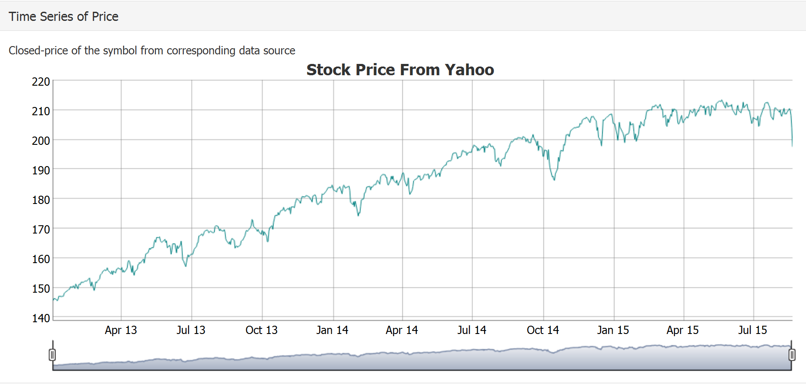

## Introduction

This is a shiny app to find the finance data from multiple sources in one place and analyze its returns.
This demomstration is going to show you the following functions:

1. Retrieve financial data from different source
2. Visualize price time series over selected period and calculate log price return with the same time range as price time series
3. Perform explortary analysis of the return time series  
  1. Histogram : gives the distribution of return within bins
  2. Boxplot : displays five number summary(min,1st quarter,median,3rd quarter,,max) of return
  3. Normal QQ-plot : compare the shapes of return with normal distribution
  4. Kernal density plot : it applies the gaussian kernel to estimate the pdf of the return
  5. Autocorrelation function (ACF) and partial autocorrelation (PACF): it can be used to tentatively identify the numbers of AR and/or MA terms. 


--- .class #id 

## Available Finance Data Source
There is no single source that contains all the finance data. Therefore, this app provides three data source: 

1. Yahoo Finance : a general search engine for Stock/Index symbols such as: SPY(SP500),GOOG
2. OANDA: a specialized source for FX currency data(such as USD/JPY ) and metal commodity(such as XAU/XAG for gold/silver pair, XAU/USD for  gold/USD pair),
3. FRED : Economic data from federal bank such as FEDFUNDS for Federal fund rate, DGS10 for 10Yr Treasury rate, CPIAUCNS for consumer price index

```{r,echo=FALSE,warning=FALSE}
if(!require("quantmod")){
  install.packages("quantmod")
  library(quantmod)
}

if(!require("PerformanceAnalytics")){
  install.packages("PerformanceAnalytics")
  library(PerformanceAnalytics)
}

if(!require("dygraphs")){
  install.packages("dygraphs")
  library(dygraphs)
}
```
Quantmod package is applied to retrieve data from seleted source and date range like below: 

```{r,warning=TRUE,message=FALSE}
data <- getSymbols("SPY",from = "2013-01-01",to = "2015-01-01",
                   src = "yahoo",auto.assign = FALSE)
```


--- .class #id 

## Time Series of Symbol Price & Return
Data returned by quantmod package are xts(eXtensible Time Series). There are many packages can be used to visualize it. In this shiny app, we use the R interface to dygraphs javascript package. Click on the tab on the right to see the price of symbol over seleted time range.  

```{r,eval=FALSE}
dygraph(as.xts(Return.calculate(Cl(data)),method = "log"),main = "Return",group="yahooData") 
%>% dyRangeSelector()
dygraph(Cl(data),main = "Stock Price From Yahoo",group="yahooData") %>% dyRangeSelector()
```
The sample outputs for price and return are:  

  


--- .class #id 

## Exploratory Analysis of Symbol Return

```{r,echo=FALSE,warning=FALSE}
    par(mfrow = c(2,3))
    Adtmp <- Return.calculate(Ad(data),method = c("log"))
    hist(Adtmp, main="Histogram of Return", xlab="Return")
    boxplot(as.data.frame(Adtmp),ylab="Return",main="Boxplot of Return ",horizontal = T)
    qqnorm(as.vector(na.omit(Adtmp[,1])),main="Normal Q-Q Plot of Return")
    qqline(as.vector(na.omit(Adtmp[,1])))
    plot(density(as.vector(na.omit(Adtmp[,1])), type = "l", xlab = "Return", 
         ylab = "density estimate", col = "slateblue1"),main="Kernel Density Plot of Return")
    acf(as.vector(na.omit(Adtmp[,1])),main="ACF of Return")
    pacf(as.vector(na.omit(Adtmp[,1])),main="PACF of Return")
```


